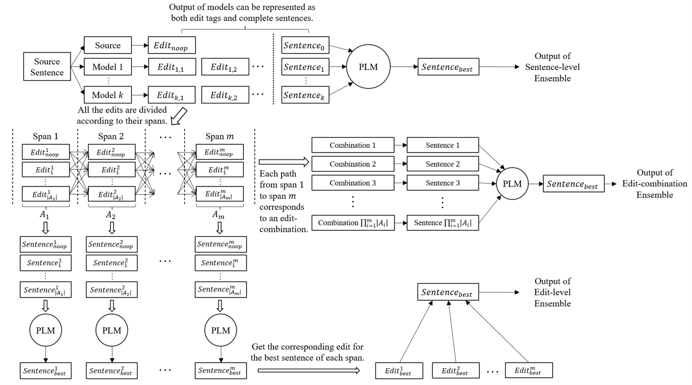

# PLM-based CGEC Model Ensemble

[](https://aclanthology.org/2023.acl-short.77/)
[](https://arxiv.org/abs/2305.15183)
[](LICENSE)

Source code of the ACL 2023 short paper **Are Pre-trained Language Models Useful for Model Ensemble in Chinese Grammatical Error Correction?**

## Get Started
- Put our code into the [ChERRANT](https://github.com/HillZhang1999/MuCGEC/tree/main/scorers/ChERRANT) directory provided by [MuCGEC](https://github.com/HillZhang1999/MuCGEC) in order to run the ensemble.
- Put the output of models you want to ensemble into anywhere as you want. All these files should be formatted as M2.
- Set the `SRC_FILE` variant in our shell scripts in `ensemble` to the path of the source text file (one original sentence each line).
- Write the path of your model outputs into a text file (one path each line) and set the `MODEL` variant in our shell scripts in `ensemble` to this text file so that our ensemble script can read your model outputs.
- Download BERT-base-Chinese, MacBERT-base-Chinese and GPT2-Chinese to `ensemble/PLM`.
- Set the `OUT_DIR` variant in our shell scripts in `ensemble` to the directory of the ensemble result you want to save.
- Run the scripts in `ensemble` to carry out the ensemble.

## Our Model Ensemble Approaches

- Sentence-level Ensemble
- Edit-level Ensemble
- Edit-combination Ensemble

Please refer to the Python codes in `ensemble` for details of our ensemble strategies.

## Statements and Acknowledgements
- Our code is built on the basis of the [ChERRANT](https://github.com/HillZhang1999/MuCGEC/tree/main/scorers/ChERRANT) scorer provided by [MuCGEC](https://github.com/HillZhang1999/MuCGEC).
- Our work is supported by the National Hi-Tech RD Program of China (No.2020AAA0106600), the National Natural Science Foundation of China (62076008) and the Key Project of Natural Science Foundation of China (61936012).

## Citation
If you find our work useful, feel free to cite our paper:

```
@inproceedings{tang-etal-2023-pre,
    title = "Are Pre-trained Language Models Useful for Model Ensemble in {C}hinese Grammatical Error Correction?",
    author = "Tang, Chenming  and
      Wu, Xiuyu  and
      Wu, Yunfang",
    booktitle = "Proceedings of the 61st Annual Meeting of the Association for Computational Linguistics (Volume 2: Short Papers)",
    month = jul,
    year = "2023",
    address = "Toronto, Canada",
    publisher = "Association for Computational Linguistics",
    url = "https://aclanthology.org/2023.acl-short.77",
    pages = "893--901",
    abstract = "Model ensemble has been in widespread use for Grammatical Error Correction (GEC), boosting model performance. We hypothesize that model ensemble based on the perplexity (PPL) computed by pre-trained language models (PLMs) should benefit the GEC system. To this end, we explore several ensemble strategies based on strong PLMs with four sophisticated single models. However, the performance does not improve but even gets worse after the PLM-based ensemble. This surprising result sets us doing a detailed analysis on the data and coming up with some insights on GEC. The human references of correct sentences is far from sufficient in the test data, and the gap between a correct sentence and an idiomatic one is worth our attention. Moreover, the PLM-based ensemble strategies provide an effective way to extend and improve GEC benchmark data. Our source code is available at https://github.com/JamyDon/PLM-based-CGEC-Model-Ensemble.",
}
```
